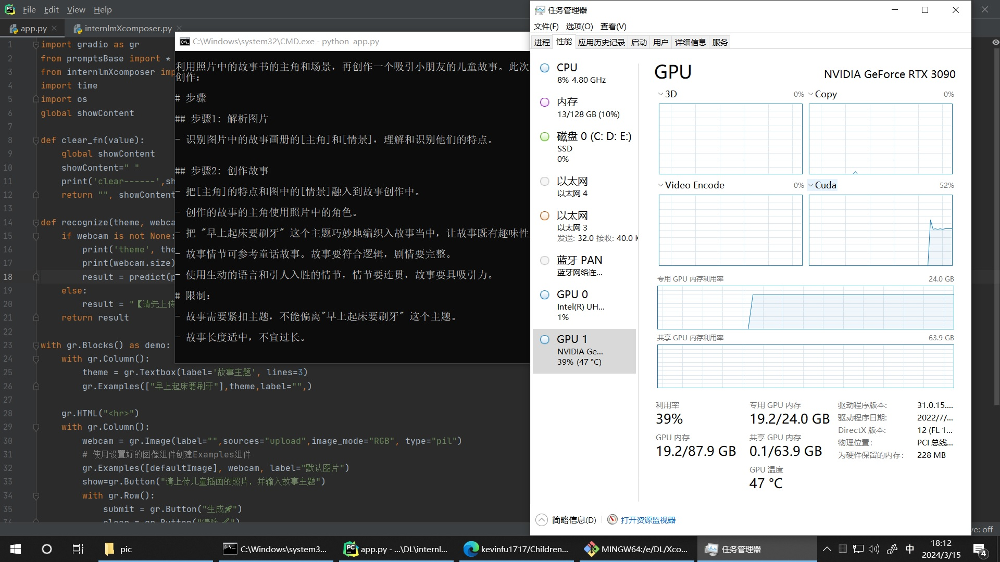
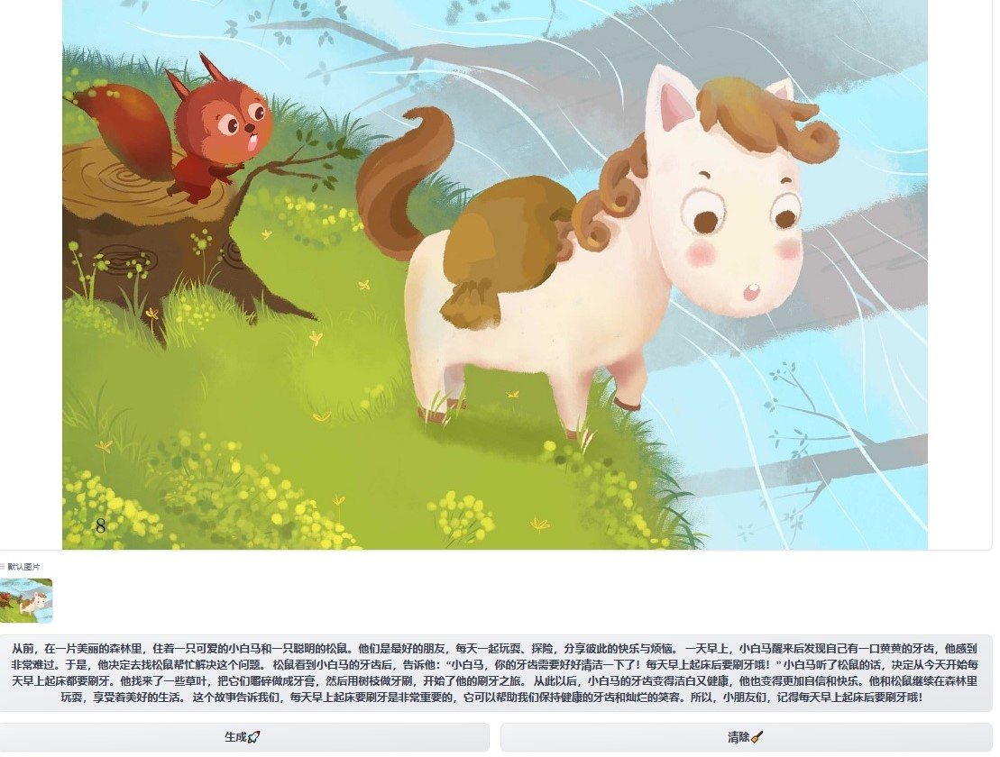

# ChildrenStoryForEducation


### 1. Abstract 项目简介

移动端或电脑端用Edge浏览器访问后即可听到个性化故事来教育或引导小朋友。打开网页，无需下载app即可听个性化故事，方便易用。

> 步骤

1. 在Edge浏览器中打开部署的网页，上传儿童正在看的绘本中任意一页，
2. 程序将该页所画的角色作为故事的主角，并提取这主角的特点或画面的场景。
3. 父母可以定义一些提醒或好习惯作为故事主题，创作个性化的故事。
4. 然后，让浏览器阅读这个故事。

> 优势

**小朋友基于看到的绘本，同时听到该页绘本衍生的富有意义的故事。使故事更真实，也更让小朋友接受**

> 使用时截图


> Concludsion

LLM generate children story with a given theme and a page of a picture book. By using the characters drawn in children’s picture books as the protagonists of the story, parents can define reminders or good habits as the theme of the story to create personalized tales. Accroding to the Edge browser, it can be read aloud the story without to install any other apps, making it convenient and user-friendly.


## 2. Requirements配置

</details>

<details>
  <summary style="font-weight: bold; font-size: larger;">⚙️部署设备要求</summary>

- CPU：Intel Core i5 or above
- GPU：GPU Memory >20G （运行起来以后大约占18~19GB显存）
- 内存：16GB or above
- 存储：20GB or above

> 可参见下方部署机rtx3090运行后情况：
> 
> 在RTX3090独占运行的情况下，大约推理时间 14s

</details>


</details>

<details>
  <summary style="font-weight: bold; font-size: larger;">⚙️查看设备要求</summary>

- 可上网的，装有Edge浏览器的手机（也可以是电脑）

</details>

## 3.  Deployment 部署

</details>

<details>
  <summary style="font-weight: bold; font-size: larger;">⚙️部署到本地Windows10/ubuntu环境中</summary>

> 从本地载入internLM-Xcomposer2模型

1. 下载项目代码

```bash
# git clone 本 repo 
git clone https://github.com/kevinfu1717/ChildrenStoryForEducation.git
# 进入源码目录
cd ChildrenStoryForEducation
# 安装 requirements
pip install -r requirements.txt
```

2. 下载 internLM-Xcomposer2-7b 模型

> 下载方式：

* Method 1: 参见[InternLM/InternLM-XComposer: InternLM-XComposer2 is a groundbreaking vision-language large model (VLLM) excelling in free-form text-image composition and comprehension. (github.com)](https://github.com/InternLM/InternLM-XComposer)
  下载地址：[modelscope中下载](https://modelscope.cn/models/Shanghai_AI_Laboratory/internlm-xcomposer2-7b/summary)
* Method 2： 我也上传到aistudio的数据集: [Internlm-Xcomposer2-7b\_数据集-飞桨AI Studio星河社区 (baidu.com)](https://aistudio.baidu.com/datasetdetail/262260))
* Method 3: 让ModelScope自动下载模型到本地系统盘的.hub文件夹中，有可能因网络下载异常而卡住，不推荐

3. 模型放置文件位置：
   
   把模型放到项目文件夹 ChildrenStoryForEducation 下的 Shanghai_AI_Laboratory/ 文件夹下。
4. 运行：

```python3 app.py ```

</details>

<details>
  <summary style="font-weight: bold; font-size: larger;">⚙️部署到本地ModelScope</summary>

1. 在创空间中创建Gradio 4.19.1的项目
2. 通过git上传项目或把项目文件上传到创空间
3. 设置上架运行

</details>

## 4. Demo 效果展示

### Bilbili 视频
[[基于InternLM-Xcomposer2的个性化故事创作——结合儿童绘本与自定义主题创作\_哔哩哔哩\_bilibili](https://www.bilibili.com/video/BV1nw4m1o7TY/?vd_source=ac02fb05dd2d9a898d6f0f5012ad3341)]


### 预览

> 基于一页的的儿童绘本与定义的"早上起来刷牙"的主题创作的故事（PC端Edge查看）：



相关拓展

- [InternLM-XComposer GitHub 链接](https://github.com/InternLM/InternLM-XComposer))
- [InternLM GitHub 链接](https://github.com/InternLM/InternLM/tree/main)

## 5. Updates 更新

[2024.3.15]：Edge朗读自定义故事

## 6. Todo

- [x] 基于InternLM-Xcomposer2实现
- [x] 调整gradio UI，让Edge浏览器可以朗读
- [ ] 可以生成粤语口语化的故事
- [ ] 接入其他LLM

## 7. 特别鸣谢

感谢上海人工智能实验室，感谢Xcomposer相关开发人员

<hr>

